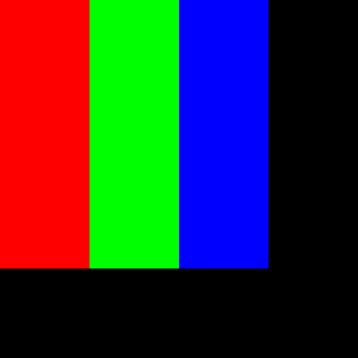

# Pixellizer

Pixellizer is a short Jupyter script that converts an image into a pixellized version. The script by default creates a white image of FullHD screen size which then gets pixellized so that each pixel is either of red, green, blue or black color.

## How it works?
1. The script by default creates a white image of size 1920x1080.
2. Then the width and height of the image is read automatically and all the common denominators of the dimentions are listed (but feel free to adjust the size as you please)
3. Next the pixel size should be set. You can get the most out of the script with the `single_pixel_size = 4` as each colour will be displayed by just one pixel on the screen.
4. The result will be put into **wallpaper/output_image** 

## Notes
- Any denominator `x` that meets `(x-1) % 3 == 0` will result in the colours of equal size. In any other - the blue color will be larger so as to fit the square dimensions of the pixel. 
- There is always `1px` size of black gap between pixels (check out the Graphics section for how an ideal pixel should look like).
- Any pixel size that is not the common denominator will result in a larger gap on the right hand side of the resulting image.

## Graphics

|The visualisation of a single pixel after the script processing |An image with the resolution of iPhone 15 Pro Max| The pixellized version|
|---|---|---|
||||